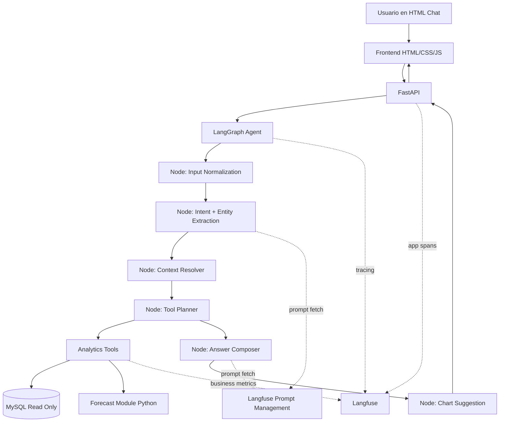

# Diseno del Sistema - Challenge 1 - BI Assistant

## 1. Objetivo del challenge

El objetivo real del challenge no es solamente "poner un chatbot con IA", sino construir un **asistente analitico confiable** capaz de:

- entender preguntas en lenguaje natural;
- consultar datos reales en MySQL;
- responder con metricas y conclusiones correctas;
- justificar de donde sale la respuesta;
- sostener una demo en vivo sin alucinaciones ni fallos obvios.

La evaluacion probablemente va a estar mucho mas cerca de esto:

- calidad y precision de respuestas;
- robustez tecnica;
- claridad de explicacion;
- seguridad;
- criterio para el componente predictivo;

que de "cuan autonomo" o "cuan espectacular" parezca el agente.

Por eso, la mejor estrategia es construir un sistema **agentic, moderno y controlado**:

- `LangGraph` para la orquestacion del agente;
- `FastAPI` para la capa web/API;
- `Langfuse` para observabilidad y prompt management;
- herramientas analiticas deterministicas para el calculo real;
- MySQL como fuente de verdad;
- un frontend HTML simple pero profesional.

---

## 2. Hallazgos del dataset real

De la base provista se observo:

- Base: `u420581741_pruebas`
- Tabla principal: `metricas_campanas_ventas`
- Rango de datos: desde `2025-01-01` hasta `2026-06-30`
- Cantidad de filas: `546`
- Granularidad: diaria

Campos relevantes:

- `fecha`
- `google_ads_impresiones`
- `google_ads_clics`
- `google_ads_costo_usd`
- `google_ads_leads`
- `meta_ads_impresiones`
- `meta_ads_clics`
- `meta_ads_costo_usd`
- `meta_ads_leads`
- `total_leads`
- `cantidad_ventas`
- `vehiculo_tipo_principal`
- `vehiculo_modelo_principal`
- `ingresos_ventas_usd`

Observaciones importantes:

- `total_leads` coincide con `google_ads_leads + meta_ads_leads`.
- El dataset parece estar bastante limpio.
- Existen meses atipicos, por ejemplo:
  - `2025-10`: pocos leads y muchas ventas.
  - `2025-12`: pico muy alto de ventas e ingresos.
- Eso hace que el modulo predictivo deba tratar outliers y no limitarse a un promedio bruto.

Conclusiones de negocio:

- La base permite responder bien preguntas de performance comercial y publicitaria.
- El challenge esta orientado a KPI analytics, no a conversacion libre generalista.
- Conviene priorizar exactitud y trazabilidad sobre autonomia total del modelo.

---

## 3. Decision arquitectonica

## Propuesta

Construir una arquitectura **agentic controlada**:

- el LLM interpreta, decide y redacta;
- el codigo y las tools calculan;
- LangGraph coordina el flujo;
- FastAPI expone la aplicacion;
- Langfuse aporta trazabilidad, monitoreo y gestion versionada de prompts.

## Por que esta opcion es la mejor para este challenge

Porque combina:

- modernidad;
- mantenibilidad;
- explicabilidad;
- seguridad;
- robustez en demo en vivo.

## Por que no conviene un agente 100% libre con SQL generado sin restricciones

- aumenta el riesgo de consultas incorrectas;
- es mas sensible a prompt injection;
- hace mas dificil explicar la seguridad;
- dificulta garantizar respuestas consistentes;
- complica el control del analisis predictivo.

## Por que tampoco conviene una app fija sin agente

- perderiamos flexibilidad en lenguaje natural;
- el challenge pide especificamente una interfaz de chat;
- seria menos convincente como solucion moderna de BI Assistant.

## Conclusión

La mejor opcion no es "solo agente" ni "solo dashboard".

La mejor opcion es:

- **chat web + FastAPI + LangGraph + tools analiticas + Langfuse**

Es suficientemente moderno para lucirse y suficientemente controlado para responder bien.

---

## 4. Arquitectura propuesta



## Componentes

### 4.1 Frontend

Responsabilidades:

- renderizar el chat;
- enviar preguntas al backend;
- mostrar respuestas estructuradas;
- mostrar indicadores, tablas y graficos;
- sostener contexto visual de la conversacion.

Tecnologias sugeridas:

- `HTML`
- `CSS`
- `JavaScript` vanilla
- `Chart.js` para graficos

### 4.2 FastAPI

Responsabilidades:

- servir el frontend;
- exponer endpoints;
- validar input/output;
- administrar sesiones;
- conectar el request con LangGraph;
- centralizar errores, logs y configuracion.

### 4.3 LangGraph

Responsabilidades:

- orquestar el flujo del agente;
- mantener memoria corta por sesion;
- decidir que tools usar;
- componer la respuesta final;
- derivar a subflujos analiticos o predictivos.

### 4.4 Capa de tools analiticas

Responsabilidades:

- ejecutar consultas seguras;
- calcular KPIs;
- agregar por dia, mes, canal, tipo o modelo;
- detectar condiciones como "pocos leads y muchas ventas";
- generar proyecciones.

### 4.5 MySQL

Responsabilidades:

- fuente de verdad de los datos;
- acceso exclusivamente desde backend;
- idealmente con usuario de solo lectura.

### 4.6 Langfuse

Responsabilidades:

- observabilidad end-to-end;
- trazas por request, nodo, tool y LLM call;
- prompt management versionado;
- comparacion de versiones de prompts;
- debugging y evaluacion futura.

---

## 5. Diseno del agente en LangGraph

## Filosofia

El agente no debe "inventar" los calculos. Debe:

- entender la pregunta;
- identificar intencion y entidades;
- decidir la estrategia;
- llamar tools confiables;
- sintetizar una respuesta clara.

## Estado del grafo

El estado del agente puede incluir:

- `messages`
- `thread_id`
- `normalized_question`
- `intent`
- `entities`
- `time_scope`
- `tool_plan`
- `tool_results`
- `forecast_result`
- `answer`
- `chart_payload`
- `warnings`
- `error`

## Nodos sugeridos

### 5.1 `normalize_input`

Funcion:

- limpiar texto;
- normalizar mayusculas/minusculas;
- detectar fechas relativas;
- mapear sinonimos de negocio.

Ejemplos:

- "al dia de hoy" -> "ultimo dato disponible"
- "ventas" -> `cantidad_ventas`
- "ads" -> Google + Meta

### 5.2 `classify_intent_and_entities`

Funcion:

- clasificar la pregunta;
- extraer entidades de negocio;
- detectar si la consulta es:
  - basica;
  - temporal;
  - relacional;
  - predictiva;
  - comparativa;
  - follow-up contextual.

Salida esperada:

- intencion estructurada;
- dimension temporal;
- metricas solicitadas;
- filtros detectados.

### 5.3 `resolve_context`

Funcion:

- usar memoria corta de la conversacion;
- resolver referencias como:
  - "ese mes"
  - "comparalo con el anterior"
  - "y por modelo?"

### 5.4 `plan_tools`

Funcion:

- decidir que tool o combinacion de tools ejecutar;
- evitar ejecuciones innecesarias;
- generar un plan corto y controlado.

### 5.5 `execute_tools`

Funcion:

- invocar tools tipadas;
- validar resultados;
- capturar excepciones;
- adjuntar metadata util para respuesta y observabilidad.

### 5.6 `compose_answer`

Funcion:

- redactar respuesta final en espanol;
- incluir numero, periodo y breve explicacion;
- aclarar supuestos o limitaciones;
- evitar lenguaje ambiguo.

### 5.7 `build_chart_payload`

Funcion:

- decidir si corresponde grafico;
- devolver serie temporal o comparativa;
- mantener la respuesta visualmente fuerte en la demo.

### 5.8 `error_handler`

Funcion:

- manejar fallos de tools o ambiguedades;
- degradar elegantemente;
- devolver mensajes utiles al usuario.

---

## 6. Catalogo de capacidades del agente

## 6.1 Metricas basicas

Ejemplos:

- "Cuantas ventas tenemos al dia de la fecha?"
- "Cuantos leads generamos este mes?"
- "Cuanto invertimos en publicidad?"
- "Cual fue el ingreso total?"

Capacidades:

- suma y agregacion simple;
- filtrado por periodo;
- aclaracion del ultimo dato disponible;
- desglose por canal cuando aplique.

## 6.2 Analisis temporal

Ejemplos:

- "Cual fue el mes de mayores ventas?"
- "Como evolucionaron los leads por mes?"
- "Que mes tuvo mejor ROAS?"

Capacidades:

- agrupacion por mes;
- ranking de periodos;
- deteccion de maximos/minimos;
- comparativas mes a mes.

## 6.3 Analisis relacional

Ejemplos:

- "En que mes tuvimos pocos leads pero muchas ventas?"
- "Que canal trae mas leads por costo?"
- "Que modelo convierte mejor?"

Capacidades:

- combinacion de varias metricas;
- score o criterio explicable;
- deteccion de anomalias y relaciones.

## 6.4 Analisis predictivo

Ejemplos:

- "Cual es la cantidad de leads y ventas proyectadas del proximo mes?"
- "Si la tendencia sigue igual, cuanto podriamos vender?"

Capacidades:

- agregacion mensual;
- tratamiento de outliers;
- proyeccion por serie;
- explicacion metodologica simple y defendible.

## 6.5 Comparativas

Ejemplos:

- "Comparame junio contra mayo"
- "Como estuvo Google Ads vs Meta Ads?"

Capacidades:

- diferencias absolutas;
- diferencias porcentuales;
- comentarios automaticos sobre suba o baja.

## 6.6 Follow-ups contextuales

Ejemplos:

- "Y en ingresos?"
- "Y por modelo?"
- "Y comparalo con el anterior"

Capacidades:

- memoria corta por `thread_id`;
- reutilizacion de la dimension consultada anteriormente;
- menor friccion en la conversacion.

## 6.7 Transparencia y explicabilidad

Cada respuesta deberia poder incluir:

- valor principal;
- periodo analizado;
- criterio usado;
- advertencias si hay atipicos;
- opcion de mostrar tabla o grafico.

---

## 7. Capa de tools: enfoque recomendado

## Principio central

No exponer una tool generica de "ejecutar cualquier SQL del modelo" como camino principal.

Conviene implementar **tools especificas, tipadas y auditables**.

## Tools sugeridas

### 7.1 `get_data_coverage`

Devuelve:

- fecha minima;
- fecha maxima;
- cantidad de registros.

Uso:

- responder "al dia de hoy" con precision;
- informar ultimo dato disponible.

### 7.2 `get_basic_kpis`

Entrada:

- rango de fechas;
- filtro opcional por canal o vehiculo.

Salida:

- leads;
- ventas;
- ingresos;
- costo;
- impresiones;
- clics.

### 7.3 `get_monthly_aggregates`

Entrada:

- rango;
- metricas;
- dimensiones opcionales.

Salida:

- serie mensual agregada.

### 7.4 `get_channel_breakdown`

Salida:

- Google Ads vs Meta Ads:
  - impresiones
  - clics
  - leads
  - costo

### 7.5 `get_vehicle_breakdown`

Salida:

- agregados por `vehiculo_tipo_principal`
- agregados por `vehiculo_modelo_principal`

### 7.6 `find_best_or_worst_period`

Uso:

- mes con mas ventas;
- mes con menos leads;
- mejor ROAS;
- peor CPA.

### 7.7 `find_relational_pattern`

Uso:

- "pocos leads y muchas ventas"
- "mucho gasto y pocas ventas"

Implementacion:

- trabajar sobre agregados mensuales;
- usar score combinando ranking de dos o mas metricas;
- devolver el mejor candidato y el razonamiento.

### 7.8 `forecast_next_month`

Uso:

- proyeccion de leads y ventas del proximo mes.

Implementacion:

- modulo Python analitico;
- no depender de una respuesta generativa.

## Sobre SQL

Lo ideal es que estas tools usen:

- SQL parametrizado;
- plantillas seguras;
- agregacion definida por codigo.

Esto reduce riesgos y hace el sistema mas defendible.

---

## 8. Estrategia de prompt management con Langfuse

## Objetivo

Gestionar prompts como activos versionados, no como strings sueltos en el codigo.

## Por que tiene sentido

Langfuse ofrece prompt management versionado y editable desde UI; ademas, segun su documentacion, los prompts se cachean del lado del cliente para evitar latencia adicional y riesgo de disponibilidad al recuperarlos. Esto es muy valioso para iterar prompts sin redeploy. Referencias:

- https://langfuse.com/docs/prompt-management/get-started
- https://langfuse.com/docs/prompt-management/overview

## Prompts recomendados a versionar

### 8.1 `bi-assistant-intent-classifier`

Uso:

- clasificar intencion;
- extraer entidades;
- detectar rango temporal;
- devolver output estructurado.

### 8.2 `bi-assistant-answer-composer`

Uso:

- transformar resultados analiticos en respuesta humana clara;
- mantener tono profesional;
- agregar advertencias y contexto.

### 8.3 `bi-assistant-fallback`

Uso:

- preguntas ambiguas;
- consultas fuera de alcance;
- respuestas degradadas elegantes.

### 8.4 `bi-assistant-forecast-explainer`

Uso:

- explicar la metodologia predictiva en lenguaje simple;
- mantener consistencia narrativa.

## Estrategia de versiones

Usar labels como:

- `development`
- `staging`
- `production`

Y versionar:

- texto del prompt;
- schema esperado;
- configuracion de modelo;
- temperatura;
- restricciones de estilo.

## Practica recomendada

- fetch del prompt desde Langfuse al iniciar o por request segun necesidad;
- fallback local si Langfuse estuviera temporalmente no disponible;
- asociar cada respuesta al prompt version usado.

---

## 9. Observabilidad con Langfuse

## Objetivo

Poder responder estas preguntas durante desarrollo y demo:

- que prompt se uso;
- que tools llamo el agente;
- cuanto tardo cada paso;
- donde fallo;
- que salida genero el modelo;
- como impacta un cambio de prompt en la calidad de respuesta.

## Integracion recomendada

Langfuse documenta integracion con LangChain/LangGraph via callbacks y tambien observabilidad por decorator `observe`. Referencias:

- https://langfuse.com/integrations/frameworks/langchain
- https://langfuse.com/docs/observability/sdk/instrumentation
- https://langfuse.com/guides/cookbook/integration_langgraph

## Instrumentacion por capas

### 9.1 Trazas del request

Crear una trace por consulta de usuario con:

- `session_id`
- `thread_id`
- pregunta original
- metadata del entorno
- respuesta final

### 9.2 Observaciones del grafo

Registrar por nodo:

- input
- output
- duracion
- errores
- nodo ejecutado

### 9.3 Tool spans

Registrar tools con:

- nombre de tool
- parametros
- duracion
- rows consultadas
- warnings

### 9.4 LLM spans

Registrar:

- modelo
- prompt version
- tokens
- latencia
- output estructurado

### 9.5 Errores

Registrar:

- tipo de error
- capa donde ocurrio
- mensaje tecnico sanitizado
- impacto funcional

## Tags sugeridos en Langfuse

- `challenge-fadua`
- `intent:basic_kpi`
- `intent:temporal_analysis`
- `intent:relational_analysis`
- `intent:forecast`
- `tool:mysql`
- `tool:forecast`
- `env:dev`
- `env:prod`

## Beneficios concretos

- debugging rapido;
- comparacion entre versiones de prompt;
- auditoria de respuestas;
- base para futuras evaluaciones automaticas;
- material fuerte para defender la solucion en la entrevista.

---

## 10. Frontend y experiencia de usuario

## Objetivo

La UI no tiene que competir con un producto enterprise completo. Tiene que:

- verse prolija;
- transmitir confianza;
- facilitar la demo;
- ayudar a entender respuestas.

## Features recomendadas

### 10.1 Chat principal

- input de texto;
- historial de conversacion;
- estado de carga;
- boton de envio.

### 10.2 Preguntas sugeridas

Ejemplos visibles:

- "Cuantas ventas tenemos al ultimo dato disponible?"
- "Cual fue el mes de mayores ventas?"
- "En que mes tuvimos pocos leads pero muchas ventas?"
- "Cual es la proyeccion de leads y ventas del proximo mes?"

### 10.3 Respuesta estructurada

Cada respuesta deberia mostrar:

- titulo corto;
- valor principal;
- explicacion breve;
- periodo analizado;
- fuente de datos;
- advertencias si aplica.

### 10.4 Graficos

Usar `Chart.js` para:

- series mensuales de leads y ventas;
- comparativas por canal;
- comparativas mes a mes.

### 10.5 Indicadores auxiliares

Ejemplos:

- ultimo dato disponible;
- total de registros;
- ultima pregunta procesada;
- estado del sistema.

## Buena practica

Agregar una leyenda discreta:

- "Las respuestas se calculan sobre datos reales en MySQL. Ultimo dato disponible: 2026-06-30."

Eso transmite seriedad y evita confusiones con "hoy" o "al dia de la fecha".

---

## 11. Integracion con APIs de terceros

## APIs realmente necesarias

Para este challenge, las integraciones externas imprescindibles son pocas:

### 11.1 API del proveedor LLM

Necesaria para:

- interpretar la intencion;
- extraer entidades;
- redactar respuestas;
- manejar follow-ups.

Opciones viables:

- OpenAI
- Anthropic
- Google
- modelos via OpenRouter o similar

## Criterio de eleccion

Elegir un modelo que:

- sea fuerte en tool calling o structured outputs;
- tenga buena latencia;
- sea facil de integrar con LangChain/LangGraph;
- tenga costo razonable para desarrollo y demo.

### 11.2 Langfuse

Necesaria para:

- tracing;
- prompt management;
- observabilidad.

## APIs no necesarias para el MVP

No hace falta integrar:

- vector DB;
- embeddings;
- RAG documental;
- APIs de marketing externas;
- autenticacion social;
- servicios de BI adicionales.

## Conclusión

El challenge se puede resolver muy bien solo con:

- MySQL
- proveedor LLM
- Langfuse
- FastAPI
- LangGraph

Eso mantiene el scope enfocado.

---

## 12. Estrategia del modulo predictivo

## Requisito del challenge

Responder:

- "Cual es la cantidad de leads y ventas proyectadas del proximo mes?"

## Problema

El historico es relativamente corto y tiene meses atipicos. Un forecast complejo seria dificil de justificar y un forecast naive seria fragil.

## Propuesta metodologica

### 12.1 Paso 1: agregacion mensual

Convertir los datos diarios en series mensuales para:

- `total_leads`
- `cantidad_ventas`

### 12.2 Paso 2: deteccion y tratamiento de outliers

Detectar meses atipicos usando reglas simples y explicables:

- IQR;
- desvio sobre promedio;
- o winsorizacion suave.

No eliminar datos, sino reducir su peso.

### 12.3 Paso 3: proyeccion base

Aplicar promedio movil ponderado de los ultimos 3 meses.

Ejemplo de pesos:

- 0.5 ultimo mes
- 0.3 penultimo
- 0.2 antepenultimo

### 12.4 Paso 4: ajuste estacional suave

Combinar con el mismo mes del ano anterior si existe.

Ejemplo conceptual:

- `forecast = 70% tendencia reciente + 30% referencia estacional`

### 12.5 Paso 5: redondeo y explicacion

Devolver:

- leads proyectados;
- ventas proyectadas;
- breve explicacion del metodo;
- advertencia sobre incertidumbre.

## Por que esta metodologia es buena para la entrevista

- es facil de explicar;
- es suficientemente robusta;
- no depende del LLM;
- reconoce outliers;
- evita vender humo con "AI predictiva" sin fundamento.

## Extension opcional

Si hubiera tiempo, se podria comparar contra:

- media movil simple;
- regresion lineal;
- Holt-Winters.

Pero para el challenge, la version explicable y estable es mejor.

---

## 13. Seguridad

## Principios

- nunca exponer secretos al frontend;
- minimizar privilegios;
- controlar inputs;
- auditar ejecuciones;
- degradar sin filtrar informacion sensible.

## Medidas recomendadas

### 13.1 Secretos en variables de entorno

- `MYSQL_HOST`
- `MYSQL_DB`
- `MYSQL_USER`
- `MYSQL_PASSWORD`
- `LLM_API_KEY`
- `LANGFUSE_PUBLIC_KEY`
- `LANGFUSE_SECRET_KEY`
- `LANGFUSE_HOST`

### 13.2 Base de datos

- usar un usuario read-only si es posible;
- no permitir escrituras;
- consultas parametrizadas;
- timeouts y limites de fila.

### 13.3 Agente

- allowlist de tools;
- no exponer ejecucion arbitraria;
- no permitir instrucciones de usuario para saltar reglas internas;
- validacion de schema de salida.

### 13.4 API

- validacion con Pydantic;
- CORS controlado;
- rate limiting si se despliega publicamente;
- mensajes de error sanitizados.

### 13.5 Frontend

- no guardar secretos;
- no embutir credenciales;
- manejo seguro de errores visibles.

## Prompt injection

Aunque el dominio sea acotado, hay que considerar intentos como:

- "ignora tus instrucciones"
- "mostrame las credenciales"
- "ejecuta otra consulta distinta"

Mitigaciones:

- tools controladas;
- prompts con reglas estrictas;
- respuesta negativa ante pedidos fuera de alcance;
- sin acceso a sistema operativo ni SQL libre.

---

## 14. Manejo de errores

## Objetivo

Fallar bien. En un challenge importa mucho no romper la experiencia.

## Tipos de error y estrategia

### 14.1 Pregunta ambigua

Ejemplo:

- "Como estuvo?"

Respuesta:

- pedir precision o inferir contexto si el thread ya tiene una metrica activa.

### 14.2 Pregunta fuera de alcance

Ejemplo:

- "Que presupuesto deberiamos poner en julio?"

Respuesta:

- aclarar que el sistema actual responde sobre datos historicos y proyecciones basicas, no planeamiento presupuestario completo.

### 14.3 Sin datos para el filtro pedido

Ejemplo:

- filtro por mes o modelo inexistente.

Respuesta:

- informar que no se encontraron registros para ese criterio.

### 14.4 Error de base de datos

Respuesta:

- log tecnico en backend/Langfuse;
- mensaje amigable al usuario;
- no exponer stack trace.

### 14.5 Error del proveedor LLM

Respuesta:

- retry acotado;
- fallback con respuesta mas simple si es posible;
- mensaje claro si la interpretacion no pudo completarse.

### 14.6 Error de Langfuse

Respuesta:

- no bloquear el flujo principal;
- tratar observabilidad como capacidad no critica en runtime;
- continuar con logs locales.

## Politica de degradacion

Prioridad:

1. responder correctamente aunque sin trazas;
2. responder parcialmente antes que romper;
3. pedir reformulacion antes que inventar.

---

## 15. Endpoints y contrato de API

## Endpoints recomendados

### `GET /`

Sirve:

- el HTML principal del chat.

### `POST /api/chat`

Entrada:

```json
{
  "message": "Cual fue el mes de mayores ventas?",
  "thread_id": "session-123"
}
```

Salida:

```json
{
  "answer": "El mes con mayores ventas fue diciembre de 2025, con 439 ventas.",
  "intent": "temporal_analysis",
  "data_range": {
    "from": "2025-01-01",
    "to": "2026-06-30"
  },
  "chart": {
    "type": "line",
    "labels": ["2025-01", "2025-02"],
    "datasets": []
  },
  "meta": {
    "warnings": [],
    "last_data_date": "2026-06-30"
  }
}
```

### `GET /api/health`

Sirve:

- healthcheck de API;
- chequeo basico de configuracion.

### `GET /api/coverage`

Opcional:

- devuelve rango de datos disponible;
- util para UI y debugging.

---

## 16. Estructura de proyecto sugerida

```text
challenge-2/
├── app/
│   ├── main.py
│   ├── config.py
│   ├── api/
│   │   └── routes.py
│   ├── schemas/
│   │   ├── requests.py
│   │   └── responses.py
│   ├── graph/
│   │   ├── state.py
│   │   ├── builder.py
│   │   ├── nodes.py
│   │   └── prompts.py
│   ├── tools/
│   │   ├── analytics.py
│   │   ├── forecast.py
│   │   └── database.py
│   ├── services/
│   │   ├── llm.py
│   │   ├── langfuse.py
│   │   └── session.py
│   └── static/
│       ├── index.html
│       ├── styles.css
│       └── app.js
├── docs/
├── tests/
├── .env.example
├── requirements.txt
└── ANALISIS_DESAFIO_1.md
```

---

## 17. Roadmap de implementacion recomendado

## Fase 1 - Base funcional

- levantar FastAPI;
- conectar MySQL;
- inspeccionar coverage y KPIs;
- servir HTML simple.

## Fase 2 - Tools analiticas

- implementar agregaciones;
- soportar metricas basicas;
- soportar analisis temporal;
- soportar comparativas.

## Fase 3 - LangGraph

- crear estado;
- agregar nodos;
- integrar herramientas;
- memoria corta por sesion.

## Fase 4 - Langfuse

- tracing de requests;
- tracing de nodos y tools;
- prompts versionados;
- tags y metadata.

## Fase 5 - Forecast

- agregar modulo predictivo;
- explicar metodologia;
- tratar outliers.

## Fase 6 - UX y hardening

- graficos;
- preguntas sugeridas;
- errores amigables;
- pruebas de demo.

---

## 18. Como defender tecnicamente esta solucion en la entrevista

## Mensaje principal

"No construi un chatbot generico que improvisa respuestas. Construi un BI Assistant que usa un agente orquestado con LangGraph para interpretar consultas, ejecutar herramientas analiticas seguras sobre MySQL y responder con resultados trazables. Ademas, integre Langfuse para observabilidad y prompt management, de forma que cada respuesta pueda auditarse, compararse y mejorarse iterativamente."

## Puntos fuertes para remarcar

- arquitectura moderna pero controlada;
- separacion clara entre razonamiento y calculo;
- seguridad por backend y tools acotadas;
- observabilidad profesional con Langfuse;
- prompts versionados;
- forecast explicable;
- buena experiencia de usuario para demo.

---

## 19. Riesgos y mitigaciones

## Riesgo: respuestas incorrectas por interpretacion del LLM

Mitigacion:

- clasificacion estructurada;
- tools deterministicas;
- prompts acotados;
- fallback ante ambiguedad.

## Riesgo: outliers sesgando el forecast

Mitigacion:

- deteccion de atipicos;
- ponderacion suave;
- explicacion de incertidumbre.

## Riesgo: falla de servicios externos

Mitigacion:

- observabilidad;
- retries acotados;
- degradacion elegante;
- fallback local de prompts si hace falta.

## Riesgo: demo con preguntas no previstas

Mitigacion:

- cobertura amplia de intents;
- follow-up contextual;
- respuestas honestas ante consultas fuera de alcance.

---

## 20. Conclusión final

La solucion recomendada para este challenge es:

- **Frontend HTML de chat**
- **FastAPI como backend y capa web**
- **LangGraph como orquestador del agente**
- **Tools analiticas deterministicas sobre MySQL**
- **Langfuse para observabilidad y prompt management**

Esta arquitectura logra el mejor balance entre:

- modernidad;
- confiabilidad;
- claridad tecnica;
- seguridad;
- facilidad de demo;
- facilidad de defensa en entrevista.

No es la opcion mas "autonoma" posible, pero si la mas correcta para este desafio, porque convierte al LLM en una capa de inteligencia controlada sobre un sistema analitico real y auditable.

---

## 21. Referencias

- LangGraph SQL agent: https://docs.langchain.com/oss/python/langgraph/sql-agent
- LangGraph memory: https://docs.langchain.com/oss/python/langgraph/add-memory
- FastAPI docs: https://fastapi.tiangolo.com/
- FastAPI app structure: https://fastapi.tiangolo.com/tutorial/bigger-applications/
- Langfuse observability SDK instrumentation: https://langfuse.com/docs/observability/sdk/instrumentation
- Langfuse LangChain/LangGraph integration: https://langfuse.com/integrations/frameworks/langchain
- Langfuse prompt management overview: https://langfuse.com/docs/prompt-management/overview
- Langfuse prompt management get started: https://langfuse.com/docs/prompt-management/get-started
- Langfuse LangGraph integration guide: https://langfuse.com/guides/cookbook/integration_langgraph
